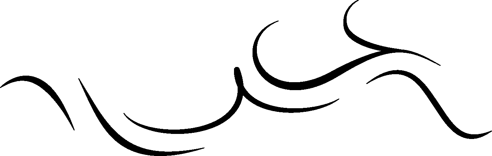
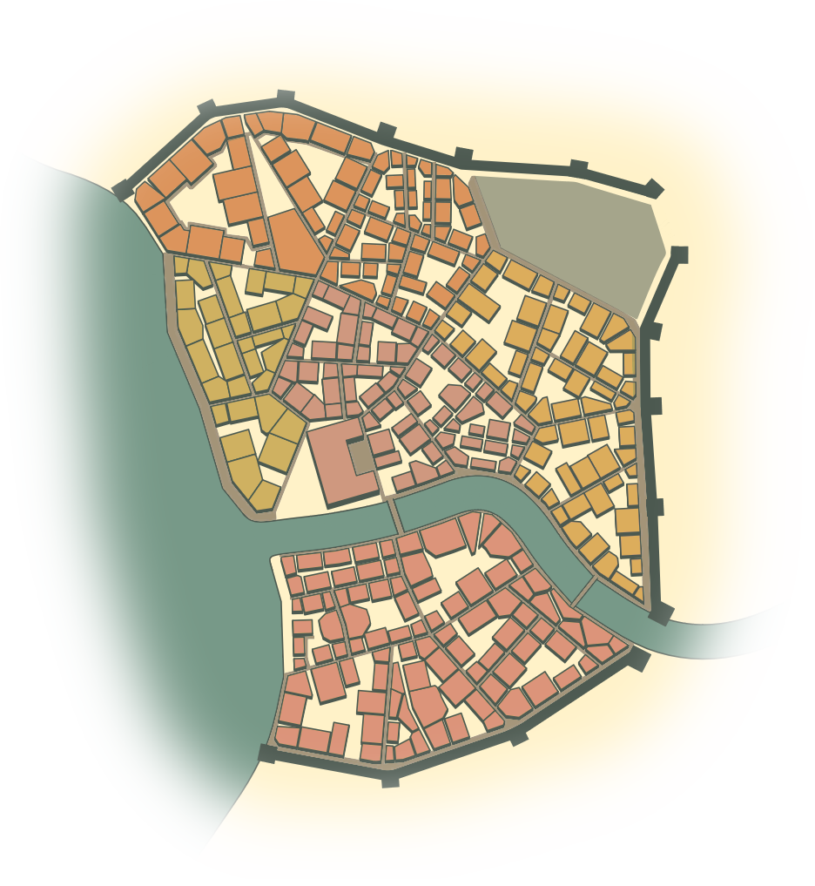
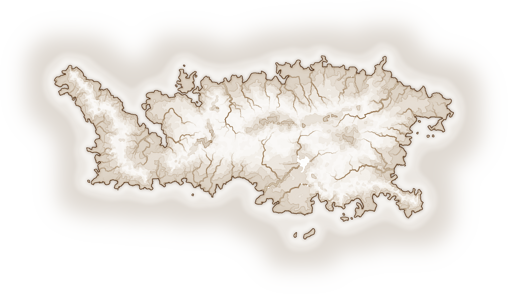
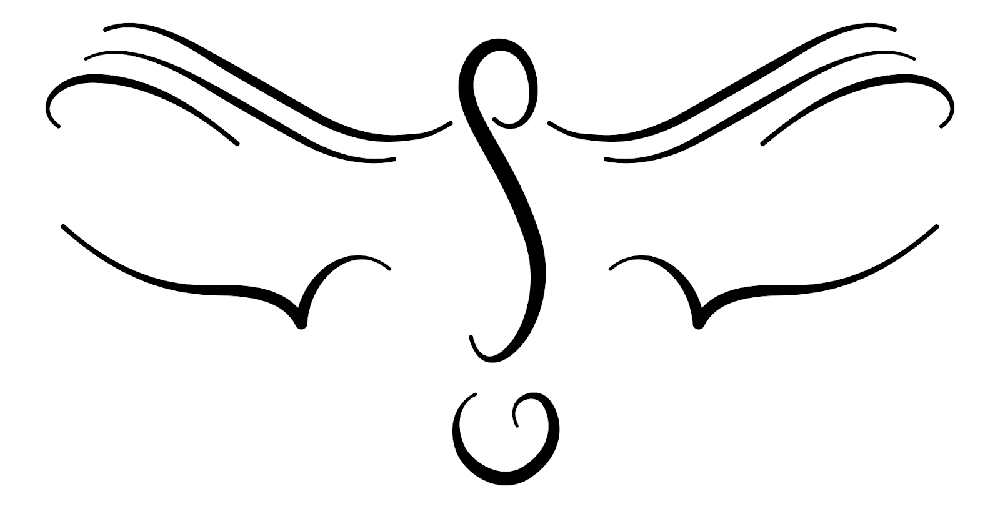
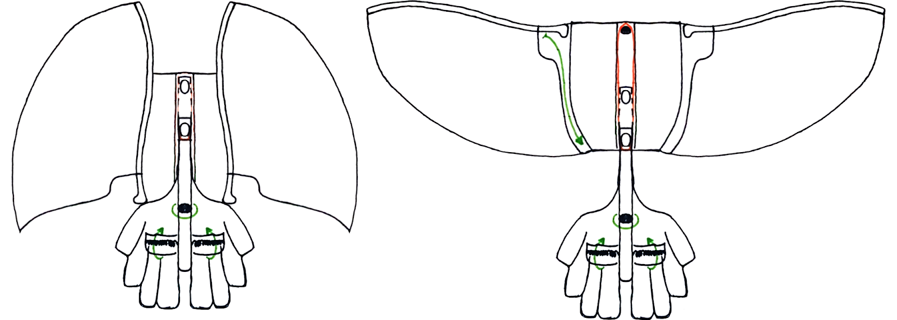
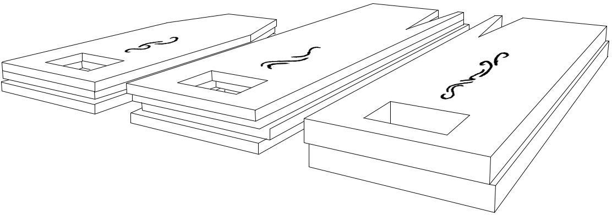

## Selung 

### The City of Voxaj

Selung is a language spoken by a people centered around the city of Voxaj, a mountaintop community of spiritualists who praise the skies for the care they bestow unto their citizens. The natural attunement they possess with the air around them keeps the city secure and its people prosperous, the artisans of Voxaj developed wooden hand gliders which have enabled them to utilise this natural harmony to soar through the breeze with swiftness and agility, though many of the skilled woodworkers that made these gliders have relocated further down the mountain to enhance their craft.

The isolation of the mountaintop makes life in Voxaj somewhat difficult; There is a  lake atop the crater in the summit. A long extinct volcanic mountain shows it's troubled history. The citizens call this lake ‘sizeng selung fal’ or ‘The Breathing Lake’ due to the change in water level through the seasons. This lake was once entirely sufficient to sustain the population of Voxaj. However, in times of scarcity a skilled workforce of haulers is now mobilised to transport water from local springs utilizing zowhan gliders and known air currents to haul great quantities of water to the capital. These haulers, gifted in their connection to the wind have a great burden to maintain smooth operation of day to day life in Voxaj, they are responsible for importing and exporting great numbers of vital resources to the mountain ranges as well as permitting access to the unenlightened peoples outside of the city.

Travel to and from Voxaj incredibly difficult for outsiders. An escort is required for every trip, yet visitors come from far and wide to learn from the wisest members of the Voxaj people. There seems to be a deep fascination with how and why the people of Voxaj have this attunement to the skies. Willing to share their ideals and spirituality, the citizens encourage outsiders to join them in their teachings as well as to partake in worship at the temple so they too can feel as light as those who were raised here. It seems that few of the immigrants can ever unburden themselves to the point where they have been able to use a zowhan but many of them report greater connection with the heavens and some notice the weight of their kin when they return from their pilgrimage.

Voxaj has a number of different districts and landmarks that can be seen on the map. At the centre of the city, Old Voxaj (voxaj oni) is the cultural and spiritual hub. This is where the old temple is where citizens and outsiders alike go to worship. This district is the oldest part of the city and is the most treasured among most citizens, the ancient walls have been restored and reinforced countless times, The people of old Voxaj accept this is a common part of their lifestyle as the buildings are designed to be given back to the earth rather than withstanding the elements for eras to come.

The eastern district is named after the strong gales through the streets, Briskwind is a district that houses many of the craftworks of the city. With close proximity to both of the city gates there is easy access to the outside forests via zowhan where they can gather their materials. To the west is the agricultural center of Lakeside, here you will find the lake farmers that cultivate the produce from sizeng selung fal that feeds the city. This is an area that is a little more weathered by the elements since it is often hit with the harsh winds and the water that follows the lake.

The Northern district Calmair is named after its sheltered geography, having no nearby gates and being sheltered from the northern winds by the outer wall, it’s exceedingly difficult for people to catch the air when using their zowhan here, thus this area houses some shady areas where the unenlightened engage in sinful activities with little risk of being pursued. These areas are few and far between though and most of the area is used as extra residential space.

New Voxaj is the most recent addition to the city, the demand emerged as more unenlightened folk travelled to the city to learn, due to this a lot of the district is temporary housing as well as study centers for those looking to understand the culture of Voxaj. On the western coast of New Voxaj can often find young citizens with their zowhan trying to find their wings for the first time. This spot is a common first flight zone as the winds are high across the lake and the surroundings are not of such importance as the fields of Lakeside or the import plane of northern Briskwind.

### Geography & Climate

### Spiritual

### Gliding Equipment

In Voxaj, the air-smiths are responsible for carefully crafting all of the handgliders that can be found in the city. There are many things that set the air-smiths apart from the regular craftspeople of the city; two distinguishing factors for the most part. The first being that they are unable to live within the confines of the city, situated instead in the midland forests of the mountain, the reason for this leads us to the next aspect that sets them apart from a regular carpenter.

The air-smiths are skilled in using the wood of the (as yet unnamed) tree, requiring an incredible amount of tending despite the fact that they grow remarkably fast. Their wood is brittle and self woven such that left to its own devices it would produce an intricate braid with many holes and knots that aren’t suitable for woodworking. However, this wood is exceedingly light making it the only option for creating handgliders that can be used to transport people and goods throughout the city.

Every handglider is unique to the tree that it was grown from, no two can be the same. The distinctive woven fingerprint is visible throughout the entire material. The gliders created by the air-smiths have a design inspired by the native (as yet unnamed) bird who actively soars through the mountain ranges. Riding thermal currents to maintain altitude, the (as yet unnamed) rarely needs to use its wings for powered ascent. As such the gliders have a large immobile wingspan utilizing a highly manoeuvrable tail construction that is controlled by the users feet.

As a curing process for a nearby plant was developed to enhance it's elastic properties. The springy quality of the plant inspired developments to fold away the more fragile or accident prone parts of the glider. Early gliders often suffered from the users tail-striking the earth as they landed, thus the retractable tail was added such that the fibres push the tail into a hollow beam in the backpiece to tuck the tail close to the waist of the user. Secondly wearing large wings throughout the city obviously presented mobility issues with frequent accidental collisions.

### Farming & Agriculture

### Currency & Trade

In order to better serve the unenlightened people coming to the city from outside, Voxaj released a currency made from offcuts of wood, the Zhaw. The wood alone has little value to the citizens who have historically traded in favours, however it ensures that those living outside the city must contribute to the city before they are permitted to benefit from it.

As mentioned, people who live in Voxaj tend to continue to trade in favours, where one doesn't buy a good but they would instead request it with an implication that the favour will be returned upon request or unprompted. The value of a favour is dependent on the relationship between the traders and their history together. Some unfamiliar traders or those who are particularly unmoving will request that this favour is returned immediately by requesting something in return. On occasion the request will be in Zhaw instead of goods which is seen as incredibly disrespectful. implying that the goods that they provide aren't worth anything to the city. This is used as a way of insulting people although normally harms the insulter more than the insultee.

Zhaw is distributed in three tokens representing 1, 6 and 36 Zhaw. These tokens are 1.5 x 5", looking like a single piece of wood these tokens are in fact two distinct pieces of wood for each side of the token. The sides adhered together have been stained dark to show the carved out markings more clearly.

### Voxaj Clothing

### Voxaj Names

### Open Questions
* What crops are there for the farmers of Voxaj to cultivate?
  * Majengi - lake lilles
  * Rice
  * Fruit Trees - Pome, Drupe

* How do more complex sentences form?

* How do the people of Voxaj track the passage of time?

* What is the history of Voxaj?

* How does the cultural music sound?

* How does religious music differ from secular music?

* What food have the citizens culturally cooked?
  * Flat bread roll

* What ingredients do voxaj people use for cooking?